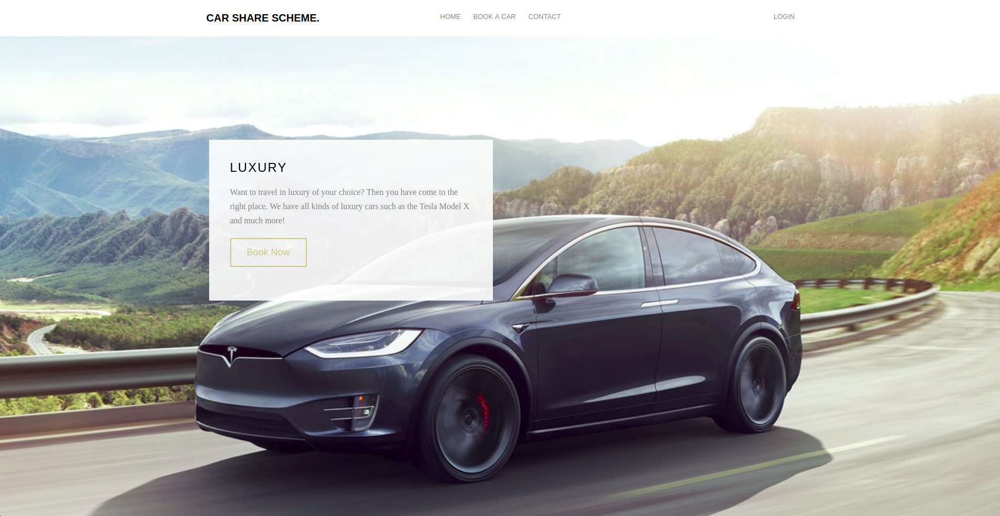
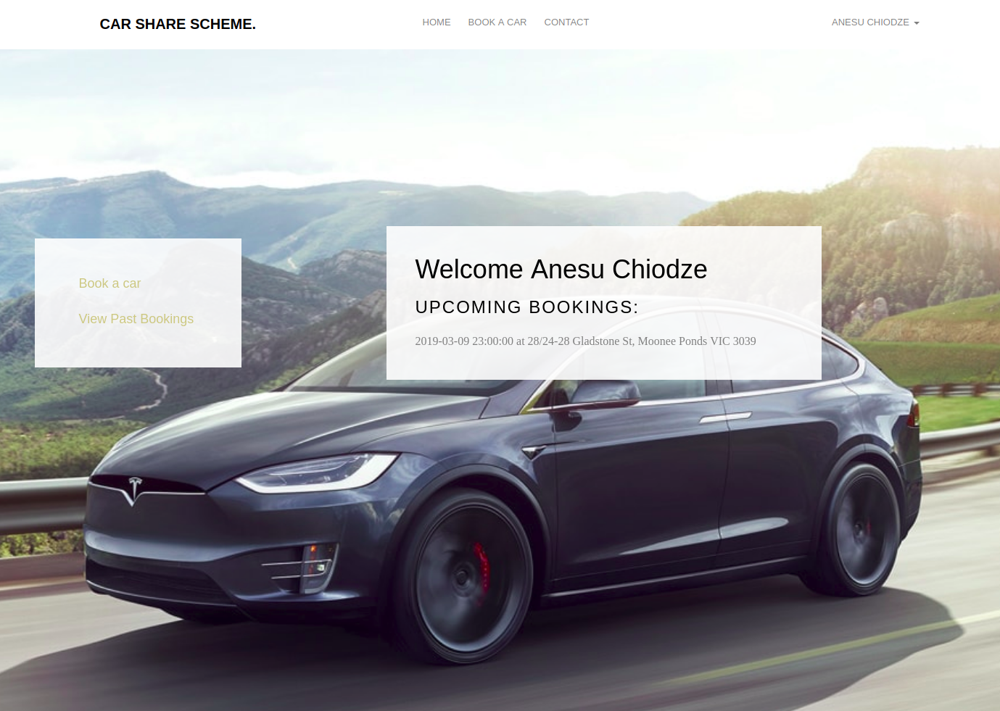
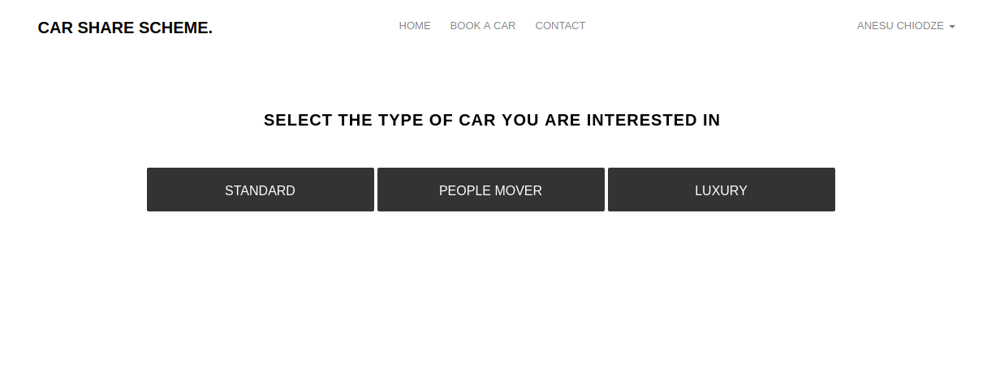
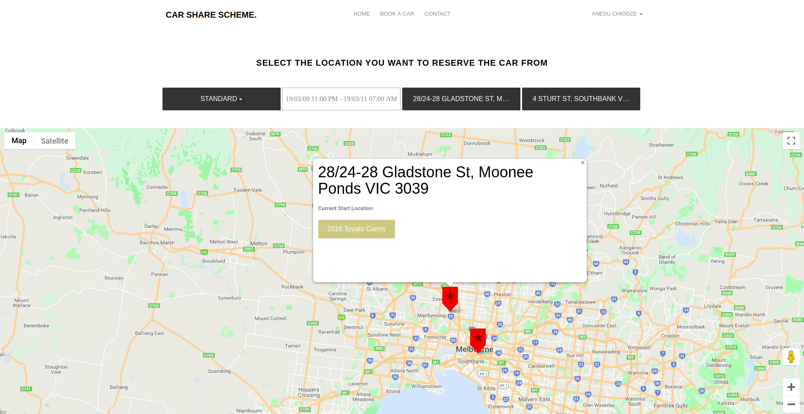
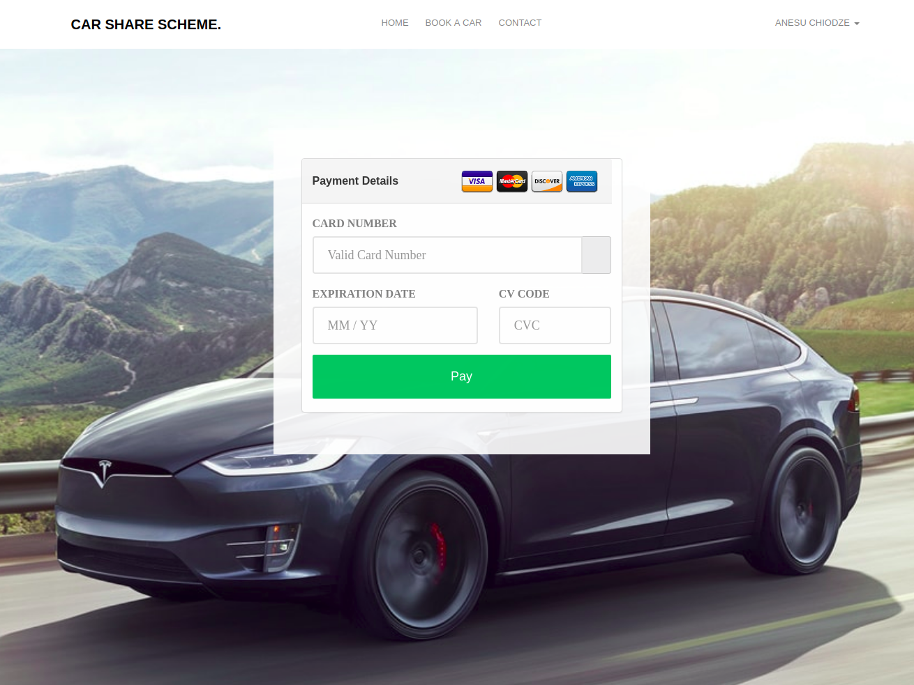

# Car Share Scheme

The objective of this project is to implement our knowledge/skills to develop a
web/mobile car share scheme platform. This application will let users pick a
vehicle in a selected location (based on the user’s location), and once the
user has finished using it, they can then return it to a nearest empty park
location. The platform will be designed to work within Melbourne (whilst
maintaining possible chances of expanding if necessary).

You can view the live demo [(here)](http://carshares.xyz/public)

Here are some screenshots from the live website:

**Home page when user is not logged in**

**Home page when user is logged in**

**First page the user gets when they want to book a car**

**The main car booking page**

**The payment details page**
